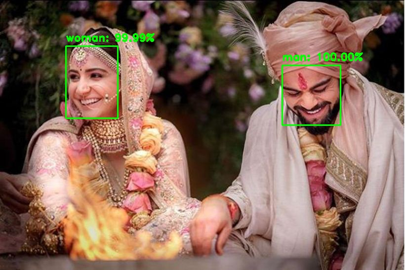

# Gender-Identifier-ML
Deep learning for gender identification from facial images written in keras and opencv

<h2>Sample output</h2>

<h2>Usage</h2>

There are two options to execute - either train the model from scratch or use the pre-trained VGGnet directly.

<h3>If you do not want to train the model.</h3>

pip install -r requirements.txt

python main.py -i input_image

  

You need matplotlib and scikit learn for training.

<h3>To train the model -</h3>

python train.py -d path-to-dataset
  

This model dosen't genearalize well although the accuracy is 96% which is good enough for most ML pipelines. Feel free to tweak with  the hyperparameters or the architecture to achieve better results.

<h2>TODO</h2>

Make this work for image3.jpg and image4.jpg.

<h2>NOTE</h2>

I have merely created a wrapper. The original work can be found <a href="https://github.com/arunponnusamy/gender-detection-keras">here</a>. Thanks Arun for this great work.

